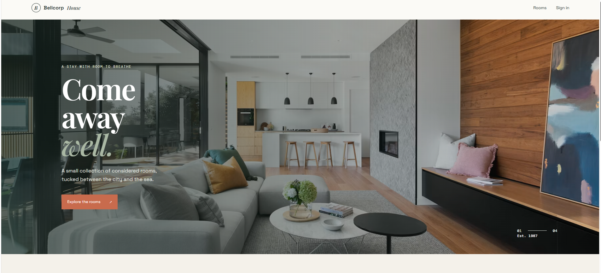
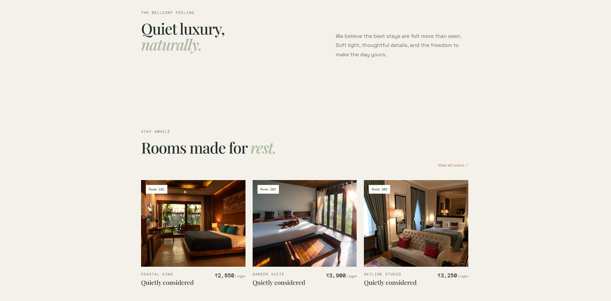
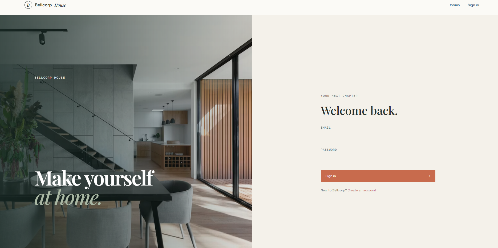
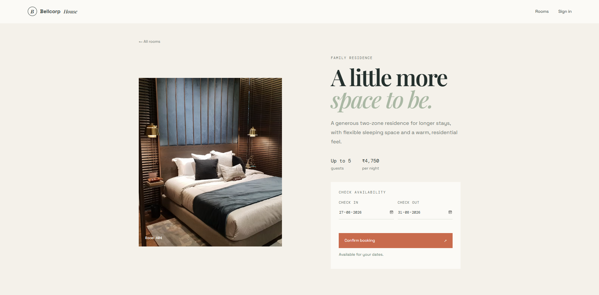
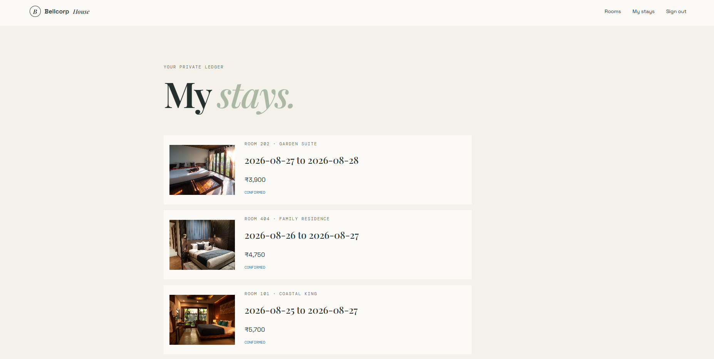

# Hotel Room Booking System

A full-stack hotel room booking system built using **React.js, Node.js, Express.js, PostgreSQL, MongoDB, and Redis**.

The system allows users to book rooms for specific date ranges while preventing overlapping bookings, including during concurrent booking requests.

## ✨ Features

* User registration and JWT login
* Book rooms with check-in/check-out dates
* View room bookings
* Prevent overlapping bookings
* PostgreSQL transactions with row-level locking
* Redis caching and rate limiting
* MongoDB activity/audit logs
* Input validation and error handling

## 🛠️ Tech Stack

* **Frontend:** React.js
* **Backend:** Node.js + Express.js
* **Primary Database:** PostgreSQL
* **Secondary Database:** MongoDB
* **Cache:** Redis
* **Authentication:** JWT + bcrypt

## 🏗️ Architecture

```text
React.js
   ↓
Node.js + Express.js
   ↓
 ┌───────────┬───────────┐
 ↓           ↓           ↓
Redis    PostgreSQL   MongoDB
Cache    Bookings     Logs
         & Users
```

## 🔐 Concurrency Handling

Booking requests are processed inside a **PostgreSQL transaction**.

The selected room row is locked using row-level locking before checking availability. This ensures that when two users try to book the same room for overlapping dates, only one request succeeds.

```text
Request → Transaction → Lock Room
                    ↓
              Check Overlap
                ↓       ↓
              Free    Already Booked
               ↓           ↓
             Book       409 Conflict
```

Checkout and the next guest's check-in can occur on the same date.

## 🔌 Main APIs

| Method | Endpoint                  | Purpose            |
| ------ | ------------------------- | ------------------ |
| POST   | `/api/auth/register`      | Register           |
| POST   | `/api/auth/login`         | Login              |
| GET    | `/api/rooms`              | View rooms         |
| POST   | `/api/bookings`           | Create booking     |
| GET    | `/api/rooms/:id/bookings` | View room bookings |

## ⚙️ Setup

```bash
git clone <YOUR_GITHUB_REPO>
cd hotel-room-booking
npm install
```

Create a `.env` file:

```env
PORT=5000
DATABASE_URL=your_postgresql_url
MONGO_URI=your_mongodb_url
REDIS_URL=your_redis_url
JWT_SECRET=your_secret
```

Start the backend:

```bash
npm run dev
```

Start the React frontend:

```bash
npm start
```

## 🧪 Concurrency Test

Example:

```text
Guest A → Room 101 → 10th–12th → ✅ Confirmed
Guest B → Room 101 → 10th–12th → ❌ Rejected
```

Only one overlapping booking is created.

## 📁 Project Structure

```text
hotel-room-booking/
├── client/
├── server/
├── database/
├── .env.example
└── README.md
```
📸 Screenshots
1. Home Page (Landing)
 
Figure 1: Landing page showing hotel branding and “Explore Rooms” option.

2. Home Page (Rooms Listing)

Figure 2: Rooms listing page where users can browse available rooms.

3. Sign In Page

Figure 3: Secure login interface with email and password fields.

5. Booking Page
 
Figure 4: Room booking form with check‑in and check‑out date selection.

6. My Stays Dashboard

Figure 5: User dashboard displaying confirmed bookings with room details and prices.

📹 Demo Video
A 5–10 minute demo showing:

Login and booking flow

[Watch Demo Video]([https://your-demo-link.com](https://www.loom.com/share/6878dc8d0bdd40b183b305a9df32fda5))

## 👩‍💻 Author

**Supritha**
4MW23CS167
Computer Science & Engineering
SMVITM
